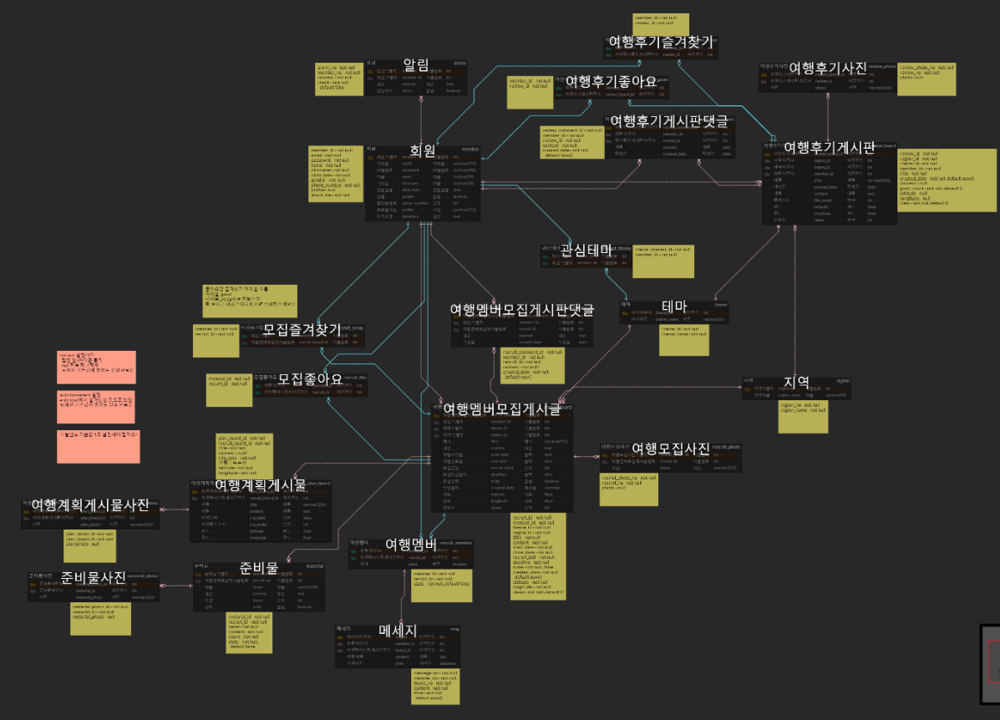

</img>
---

## 서비스 개요
#### Moyeo - 모두의 여행, 여행의 모든 것

#### 주요기능
여행 후기를 기록하고 게시하여, 여행지에 대한 정보를 공유할 수 있습니다.  또한 같이 갈 여행 인원들을 모집하거나 다른 사람의 여행에 참가해보세요. 그 이후에, 온라인에서 여행 동행자들과 실시간으로 여행을 계획할 수 있습니다.
## 프로젝트 일정

## ERD

## 사이트 맵

## 기술 스택
### Front-End
     

### Back-End
      

### Infra & Publish
   

### Tools
   

### Communication
  

## 팀 소개
